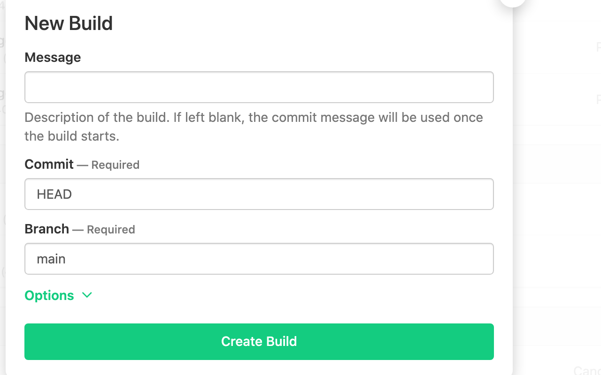

# buildkite-new-build-branch-helper :honk:

cuz i don't wanna select my branch. big lazy. 0% affiliation with
buildkite or even anyone really. affiliation free. :honk:



## usage

install the [chrome extension](). go to a buildkite page and click
`New Build`. :amaze:

## deployment

```
$ cd extension && zip -r Archive.zip .
```

upload the extension in the chrome developer dashboard

## license

MIT
